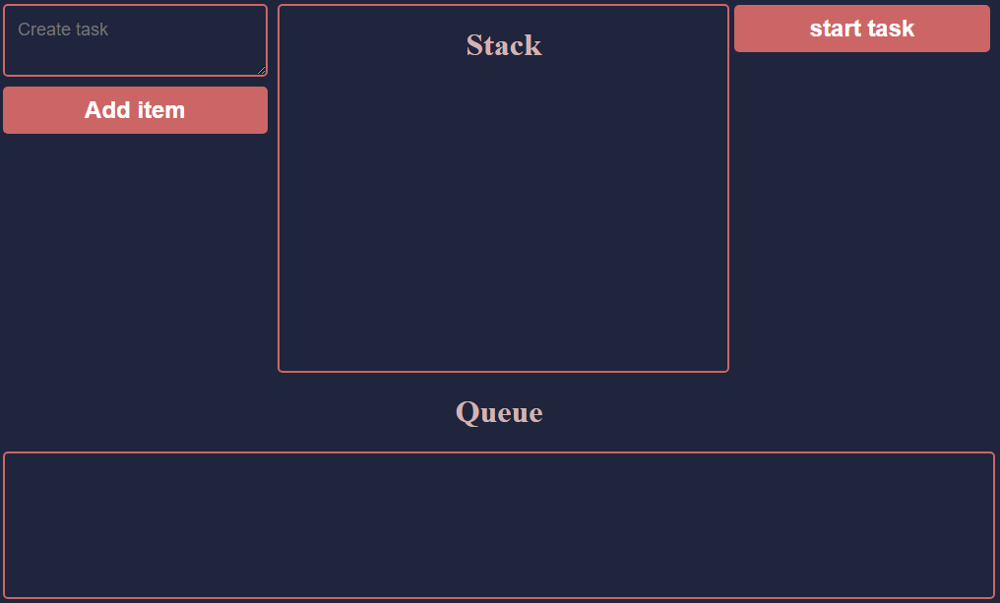

##Homework JS1

## 🧐 Tasks

Let me share the features 

-  **Visual representation of a queue**
-  **Input elemen**
-  **Search users by name** 
-  **Save dialog history after page refresh**
-  **Deploy on Netlify**
- **Input and queue should be validated for emptiness and notify user about impossible actions (or prohibit to do them)**
- **Input is cleared on addition**
- **State of the queue should be saved through page reloads**
- **Maximum items equals to Your age**
- **Logic should be separated into functions**

## 🛠️ Run project

**Download folder public, open index.html with Live Server**
 ***Check deployed  [version](https://loving-visvesvaraya-5e2565.netlify.app/)**
